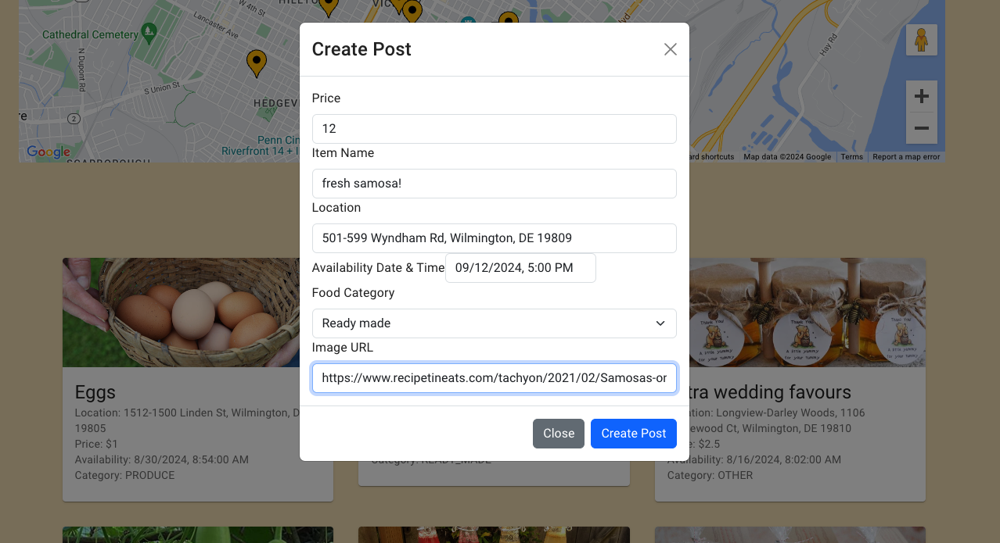

# ExtraCookies

**ExtraCookies** is a fullstack application designed to help users buy and sell homemade food and produce within their neighborhoods. It provides a platform for users to advertise their bake sales, lemonade stands, and other homemade goods, allowing others in the community to find these local offerings easily.

## Problem Statement

In a neighborhood, it can be challenging to discover local events like bake sales, lemonade stands, or individuals giving away excess produce from their gardens. Scanning through platforms like Craigslist or Facebook Marketplace for such specific needs can be inefficient and time-consuming.

**ExtraCookies** solves this problem by providing a dedicated platform where users can:

- View details about each listing, including pictures and descriptions.
  
- Advertise homemade food and produce.
  
- Find local sales and stands based on their location.
  
- Rely on seller ratings to make informed decisions.

## Features

- **Location-Based Listings**: Users can view listings based on their location and see how far away each sale or stand is from them.
- **Seller Ratings**: Each seller has a profile with ratings to help users trust and evaluate them.
- **Detailed Listings**: Sellers can post pictures and detailed descriptions of their items.
- **Mobile-Friendly Design**: The application layout adjusts for mobile devices to ensure a smooth user experience on all screens.
- **No In-App Payments**: Payments are handled outside of the application; it only displays the seller's location.

## Tech Stack

- **Frontend**:

  - **React**: For building the user interface.
  - **TypeScript** and **JavaScript**: For adding type safety and scripting.
  - **HTML** and **CSS**: For structuring and styling the application.
  - **Google Maps API**: For displaying location-based information.

- **Backend**:

  - **Java**: Primary programming language for backend development.
  - **Spring Boot**: Framework for building the backend application.
  - **JPA (Java Persistence API)**: For interacting with the database.
  - **H2 Database**: In-memory database used for development and testing.
  - **SQL**: For querying and managing the database.

  **Link to frontend**:
  https://github.com/DiptikaD/Extra-Cookies-Simple
